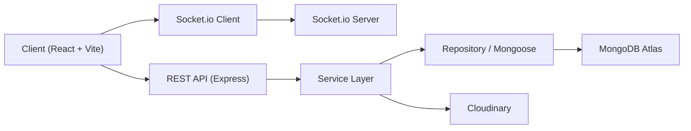

<div align="center">

# Gundam Universe Store

### Website ban hang va san trao doi giao dich Gundam theo phong cach mecha / HUD / futuristic

[](./client)
[](./server)
[](./server)
[](./server)
[](./DEPLOYMENT.md)

[](https://cloudinary.com/)
[](#bao-mat-va-hieu-suat)
[](./client)
[](./server/package.json)

</div>

---

## Muc luc

- [Tong quan](#tong-quan)
- [Gia tri cua du an](#gia-tri-cua-du-an)
- [Tinh nang noi bat](#tinh-nang-noi-bat)
- [Tech stack va phien ban](#tech-stack-va-phien-ban)
- [Kien truc he thong](#kien-truc-he-thong)
- [Cau truc thu muc](#cau-truc-thu-muc)
- [Domain model va collection](#domain-model-va-collection)
- [API chinh](#api-chinh)
- [Bao mat va hieu suat](#bao-mat-va-hieu-suat)
- [UI UX design direction](#ui-ux-design-direction)
- [Cai dat local](#cai-dat-local)
- [Bien moi truong](#bien-moi-truong)
- [Seed du lieu](#seed-du-lieu)
- [Deploy](#deploy)
- [Trang thai hien tai](#trang-thai-hien-tai)
- [Roadmap tiep theo](#roadmap-tiep-theo)

## Tong quan

`Gundam Universe Store` la mot he thong full-stack ket hop hai domain trong cung mot nen tang:

| Domain | Mo ta |
| --- | --- |
| `Gundam Store` | Ban san pham Gundam/Gunpla voi catalog, tim kiem, loc, gio hang, checkout, lich su don hang |
| `Trade Exchange` | San trao doi giao dich Gundam voi trade listing, trade offer, chat realtime, report moderation |

Du an duoc xay dung theo huong:

- kien truc module hoa, ro domain
- clean code, de doc, de mo rong
- UI dam chat mecha / sci-fi / tactical HUD
- co the dung cho do an va co kha nang phat trien tiep thanh san pham that

## Gia tri cua du an

README nay huong den 3 muc tieu:

| Muc tieu | Gia tri |
| --- | --- |
| `Do an` | Trinh bay ro kien truc, tinh nang, data flow, va huong trien khai |
| `Demo` | Co day du flow MVP de thuyet trinh va demo truc tiep |
| `Thuc chien` | Da co nen tang deploy, upload media, auth, realtime, moderation, seller/admin console |

## Tinh nang noi bat

### 1. Auth va account

| Tinh nang | Trang thai |
| --- | --- |
| Dang ky / dang nhap / dang xuat | Hoan thanh |
| Refresh token | Hoan thanh |
| Quen mat khau / dat lai mat khau | Hoan thanh |
| Doi mat khau | Hoan thanh |
| Cap nhat profile | Hoan thanh |
| Upload avatar Cloudinary | Hoan thanh |
| Ghi nho email dang nhap | Hoan thanh |
| Phuc hoi session tu refresh token | Hoan thanh |

### 2. Store module

| Tinh nang | Trang thai |
| --- | --- |
| Home page | Hoan thanh |
| Product listing | Hoan thanh |
| Search / filter / sort | Hoan thanh |
| Product detail | Hoan thanh |
| Related products | Hoan thanh |
| Rare item valuation mock | Hoan thanh |
| Cart page | Hoan thanh |
| Checkout | Hoan thanh |
| Order history | Hoan thanh |
| Order detail / tracking basic | Hoan thanh |
| Wishlist | Hoan thanh |
| Review | Hoan thanh |

### 3. Trade module

| Tinh nang | Trang thai |
| --- | --- |
| Tao trade listing | Hoan thanh |
| Upload anh listing | Hoan thanh |
| Gui trade offer | Hoan thanh |
| Upload anh offer | Hoan thanh |
| Accept / reject offer | Hoan thanh |
| Chat realtime | Hoan thanh |
| Report vi pham | Hoan thanh |
| Trade suggestion theo wishlist | MVP |

### 4. Seller va admin

| Tinh nang | Trang thai |
| --- | --- |
| Seller dashboard | Hoan thanh |
| Seller product operations | Hoan thanh |
| Seller order operations | Hoan thanh |
| Admin dashboard | Hoan thanh |
| Admin product/category/user/order management | Hoan thanh |
| Admin trade moderation | Hoan thanh |
| Admin report resolution note | Hoan thanh |

### 5. UX va state persistence

| Tinh nang | Trang thai |
| --- | --- |
| Responsive mobile / tablet / desktop | Hoan thanh |
| Split-screen friendly | Hoan thanh |
| Persist cart / wishlist / notifications | Hoan thanh |
| Persist checkout draft | Hoan thanh |
| Persist trade draft | Hoan thanh |
| Persist chat draft theo conversation | Hoan thanh |

## Tech stack va phien ban

### Frontend

| Cong nghe | Phien ban |
| --- | --- |
| React | `18.3.1` |
| React DOM | `18.3.1` |
| Vite | `5.4.1` |
| React Router DOM | `6.22.3` |
| TailwindCSS | `3.4.3` |
| Framer Motion | `11.0.24` |
| Axios | `1.6.8` |
| Zustand | `4.5.2` |
| Socket.io Client | `4.7.5` |
| Lucide React | `0.363.0` |

### Backend

| Cong nghe | Phien ban |
| --- | --- |
| Node.js | `>= 18` |
| Express | `5.2.1` |
| Mongoose | `9.3.3` |
| Joi | `18.1.2` |
| JWT | `9.0.3` |
| bcrypt | `6.0.0` |
| Socket.io | `4.8.3` |
| Cloudinary | `1.41.3` |
| Multer | `2.1.1` |
| Helmet | `8.1.0` |
| express-rate-limit | `8.3.2` |

### Tooling va deploy

| Cong nghe | Vai tro |
| --- | --- |
| MongoDB Atlas | Database production |
| Cloudinary | Luu tru media upload |
| Vercel | Deploy frontend |
| Render | Deploy backend + websocket |
| Nodemon | Dev server backend |

## Kien truc he thong

### Kien truc tong the



### Nguyen tac thiet ke

| Nguyen tac | Cach ap dung |
| --- | --- |
| `OOP` | Chia theo controller / service / repository / model |
| `SOLID` | Service xu ly nghiep vu, controller khong nhan qua nhieu logic |
| `DRY` | Tien hanh tai su dung middleware, store, helper, response wrapper |
| `KISS` | Han che nesting sau, flow route ngan gon |
| `Modular Domain` | Moi domain co route, controller, service, repository, validator rieng |

### Data flow chinh

1. User thao tac tu giao dien React.
2. Frontend gui request qua `Axios`.
3. Route Express tiep nhan request.
4. Controller dieu phoi service.
5. Service xu ly business logic.
6. Repository / model thao tac MongoDB.
7. Response tra ve theo `ApiResponse`.
8. Neu la chat / notification, Socket.io phat event realtime.

## Cau truc thu muc

```text
Gundam_Universe_Store/
├─ client/
│  ├─ src/
│  │  ├─ components/
│  │  ├─ config/
│  │  ├─ guards/
│  │  ├─ pages/
│  │  ├─ services/
│  │  ├─ shared/
│  │  ├─ stores/
│  │  ├─ styles/
│  │  ├─ utils/
│  │  ├─ App.jsx
│  │  └─ Router.jsx
│  ├─ .env.example
│  ├─ package.json
│  └─ vercel.json
├─ server/
│  ├─ scripts/
│  ├─ src/
│  │  ├─ config/
│  │  ├─ modules/
│  │  │  ├─ admin/
│  │  │  ├─ auth/
│  │  │  ├─ cart/
│  │  │  ├─ chat/
│  │  │  ├─ notification/
│  │  │  ├─ order/
│  │  │  ├─ product/
│  │  │  ├─ report/
│  │  │  ├─ review/
│  │  │  ├─ seller/
│  │  │  ├─ trade/
│  │  │  ├─ upload/
│  │  │  ├─ user/
│  │  │  └─ wishlist/
│  │  └─ shared/
│  ├─ .env.example
│  └─ package.json
├─ DEPLOYMENT.md
├─ render.yaml
└─ README.md
```

## Domain model va collection

### Collection chinh

| Collection | Vai tro |
| --- | --- |
| `users` | Tai khoan, role, profile, reputation, avatar |
| `categories` | Danh muc san pham |
| `products` | Catalog Gundam/Gunpla |
| `carts` | Gio hang cua user |
| `orders` | Don hang va snapshot item |
| `reviews` | Danh gia san pham |
| `wishlists` | Danh sach san pham yeu thich |
| `tradeListings` | Tin dang trao doi |
| `tradeOffers` | De nghi trao doi |
| `conversations` | Cuoc hoi thoai chat |
| `messages` | Tin nhan realtime |
| `notifications` | Thong bao he thong |
| `reports` | Bao cao vi pham |

### Quan he giua cac entity

| Quan he | Kieu |
| --- | --- |
| `User -> Product` | one-to-many |
| `User -> Order` | one-to-many |
| `User -> Wishlist` | one-to-one |
| `Product -> Review` | one-to-many |
| `TradeListing -> TradeOffer` | one-to-many |
| `TradeOffer -> Conversation` | one-to-one gan dung |
| `Conversation -> Message` | one-to-many |

### Embed va reference

| Kieu | Vi tri | Ly do |
| --- | --- | --- |
| `Embed` | `order.items` | Snapshot gia / ten / hinh tai thoi diem mua |
| `Embed` | `product.images` | Truy cap nhanh giao dien san pham |
| `Embed` | `tradeListing.images` | Truy cap nhanh cho trade detail |
| `Embed` | `tradeOffer.images` | Gan lien voi de nghi trade |
| `Embed` | `shippingAddress` | Co dinh theo don hang |
| `Reference` | `product.category` | Tai su dung category |
| `Reference` | `product.seller` | Lien ket seller profile |
| `Reference` | `wishlist.products` | Danh sach san pham dong |
| `Reference` | `tradeListing.owner` | Lien ket owner |
| `Reference` | `tradeOffer.offerer` | Lien ket nguoi gui offer |

## API chinh

### Auth

| Method | Endpoint | Mo ta |
| --- | --- | --- |
| `POST` | `/api/auth/register` | Dang ky |
| `POST` | `/api/auth/login` | Dang nhap |
| `POST` | `/api/auth/logout` | Dang xuat |
| `POST` | `/api/auth/refresh-token` | Lam moi access token |
| `POST` | `/api/auth/forgot-password` | Quen mat khau |
| `POST` | `/api/auth/reset-password` | Dat lai mat khau |
| `PUT` | `/api/auth/change-password` | Doi mat khau |

### Product / Store

| Method | Endpoint | Mo ta |
| --- | --- | --- |
| `GET` | `/api/products` | Listing + search/filter/sort |
| `GET` | `/api/products/:slug` | Chi tiet san pham |
| `GET` | `/api/products/:slug/recommendations` | San pham lien quan |
| `POST` | `/api/products` | Tao san pham |
| `PUT` | `/api/products/:id` | Sua san pham |
| `DELETE` | `/api/products/:id` | Xoa san pham |

### Cart / Order

| Method | Endpoint | Mo ta |
| --- | --- | --- |
| `GET` | `/api/cart` | Lay gio hang |
| `POST` | `/api/cart/items` | Them item |
| `PATCH` | `/api/cart/items/:productId` | Cap nhat so luong |
| `DELETE` | `/api/cart/items/:productId` | Xoa item |
| `POST` | `/api/orders/checkout` | Tao don hang |
| `GET` | `/api/orders/history` | Lich su mua hang |
| `GET` | `/api/orders/:id` | Chi tiet don hang |
| `PATCH` | `/api/orders/:id/status` | Admin cap nhat status |

### Trade / Chat / Moderation

| Method | Endpoint | Mo ta |
| --- | --- | --- |
| `GET` | `/api/trades` | Listing trade |
| `GET` | `/api/trades/:id` | Chi tiet trade |
| `POST` | `/api/trades` | Tao trade listing |
| `POST` | `/api/trades/:id/offers` | Tao trade offer |
| `GET` | `/api/trades/:id/offers` | Lay offer cua listing |
| `PATCH` | `/api/trades/:id/offers/:offerId/status` | Accept / reject offer |
| `GET` | `/api/trades/offers/me` | Lay offer da gui |
| `GET` | `/api/trades/suggestions/me` | Trade suggestion |
| `POST` | `/api/trades/:id/report` | Bao cao vi pham |

### Seller / Admin / Notification

| Method | Endpoint | Mo ta |
| --- | --- | --- |
| `GET` | `/api/seller/dashboard` | Dashboard seller |
| `GET` | `/api/seller/products` | Quan ly product seller |
| `PATCH` | `/api/seller/products/:id` | Update stock / status / price |
| `GET` | `/api/seller/orders` | Quan ly order cua seller |
| `PATCH` | `/api/seller/orders/:id/status` | Seller doi status order |
| `GET` | `/api/admin/stats` | Dashboard admin |
| `GET` | `/api/admin/users` | Quan ly user |
| `GET` | `/api/admin/orders` | Quan ly order |
| `GET` | `/api/admin/trades` | Moderation trade |
| `PATCH` | `/api/admin/trades/:id/status` | Doi status trade |
| `GET` | `/api/reports` | Lay danh sach report |
| `PATCH` | `/api/reports/:id/status` | Resolve / dismiss report |
| `GET` | `/api/notifications` | Lay notification |

## Bao mat va hieu suat

### Bao mat

| Hang muc | Ap dung |
| --- | --- |
| Password hash | `bcrypt` |
| Auth | `JWT access token + refresh token` |
| Refresh rotation | Co |
| Rate limit | Co |
| Security headers | `helmet` |
| NoSQL injection protection | `express-mongo-sanitize` |
| HPP protection | `hpp` |
| Request validation | `Joi` |
| Role guard | `guest / customer / seller / trader / admin` |
| Upload safety | middleware + mime/size handling |

### Hieu suat

| Hang muc | Ghi chu |
| --- | --- |
| Pagination | Product va trade listing |
| MongoDB index | name, description, tags, category, seller, trade status |
| Compression | `compression()` |
| Code splitting | Route lazy-load tren frontend |
| State persistence | Giam friction khi refresh / quay lai trang |
| Realtime room | Chat theo conversation room |

## UI UX design direction

| Thanh phan | Dinh huong |
| --- | --- |
| Mood | Mecha, sci-fi, tactical HUD, cockpit UI |
| Mau chu dao | Navy / charcoal / metallic gray |
| Accent | Cyan / red / amber |
| Card | Border glow, panel control, contrast cao |
| Motion | Framer Motion, fade/slide, hover glow |
| Layout | Responsive, split-screen friendly, de scan thong tin |

## Cai dat local

### Yeu cau moi truong

| Requirement | Gia tri |
| --- | --- |
| Node.js | `>= 18` |
| npm | `>= 9` de tranh loi workspace/phu thuoc |
| Database | MongoDB Atlas hoac MongoDB local |
| Media | Cloudinary neu muon upload anh that |

### Clone repo

```bash
git clone https://github.com/KasierBach/Gundam_Universe_Store.git
cd Gundam_Universe_Store
```

### Cai dependency

```bash
cd server
npm install

cd ../client
npm install
```

### Chay backend

```bash
cd server
npm run dev
```

Backend mac dinh:

- `http://localhost:5001`
- Health check: `http://localhost:5001/api/health`

### Chay frontend

```bash
cd client
npm run dev
```

Frontend dev mac dinh:

- `http://localhost:4000`

## Bien moi truong

### Backend

File mau: [`server/.env.example`](./server/.env.example)

```env
NODE_ENV=development
PORT=5001
MONGODB_URI=your_mongodb_uri
JWT_ACCESS_SECRET=your_access_secret
JWT_REFRESH_SECRET=your_refresh_secret
JWT_ACCESS_EXPIRES_IN=1h
JWT_REFRESH_EXPIRES_IN=30d
CLOUDINARY_CLOUD_NAME=your_cloud_name
CLOUDINARY_API_KEY=your_api_key
CLOUDINARY_API_SECRET=your_api_secret
CLIENT_URL=http://localhost:4000
CLIENT_URLS=http://localhost:4000,https://your-project.vercel.app
RATE_LIMIT_WINDOW_MS=900000
RATE_LIMIT_MAX_REQUESTS=100
```

### Frontend

File mau: [`client/.env.example`](./client/.env.example)

```env
VITE_API_URL=/api
VITE_SOCKET_URL=http://localhost:5001
VITE_DEV_API_TARGET=http://localhost:5001
```

## Seed du lieu

### Seed admin

```bash
cd server
npm run seed:admin
```

Tai khoan admin mac dinh:

| Truong | Gia tri |
| --- | --- |
| Email | `admin@gundamuniverse.com` |
| Password | `Admin@123456` |

### Seed du lieu san pham

```bash
cd server
npm run seed:data
```

Catalog seed hien tai da duoc thay bang bo san pham Gundam thuc te hon, phuc vu demo store va search/filter.

## Deploy

Phuong an deploy duoc chot san:

| Layer | Nen tang |
| --- | --- |
| Frontend | `Vercel` |
| Backend + Socket.io | `Render` |
| Database | `MongoDB Atlas` |
| Media | `Cloudinary` |

Tai lieu chi tiet:

- [`DEPLOYMENT.md`](./DEPLOYMENT.md)

File deploy:

- [`render.yaml`](./render.yaml)
- [`client/vercel.json`](./client/vercel.json)

## Trang thai hien tai

Du an hien o muc:

| Tieu chi | Danh gia |
| --- | --- |
| MVP full-stack | Manh |
| Do hoa chu de Gundam | Ro rang |
| Deploy friendly | Co |
| Seller/Admin operations | Da co nen tang tot |
| Moderation flow | Da co MVP |
| Testing | Chua day du |
| Production completeness | Chua 100% |

### Da co kha day du

- auth
- profile
- store listing
- cart
- checkout
- order history
- trade listing
- trade offer
- realtime chat
- wishlist
- notifications
- seller operations
- admin moderation co ban

### Chua full 100% production

- test suite bai ban
- dispute workflow sau hon
- community / social layer
- recommendation engine thong minh hon
- notification center realtime nang cao

## Roadmap tiep theo

| Uu tien | Hang muc |
| --- | --- |
| `P1` | Unit test / integration test / e2e |
| `P1` | Dispute workflow nhieu buoc |
| `P2` | Community feed / collector showcase |
| `P2` | Recommendation engine theo hanh vi |
| `P2` | Analytics nang cao cho seller/admin |
| `P3` | Notification center realtime nang cao |
| `P3` | Email service that cho reset password |

---

## Ghi chu

README nay duoc viet theo huong:

- de nop do an
- de doc tren GitHub
- de onboarding cho nguoi tiep quan repo
- de lam tai lieu tong quan cho phase deploy va bao cao

Neu can, co the tach tiep cac tai lieu sau:

- `docs/architecture.md`
- `docs/api-reference.md`
- `docs/erd.md`
- `docs/presentation-notes.md`
