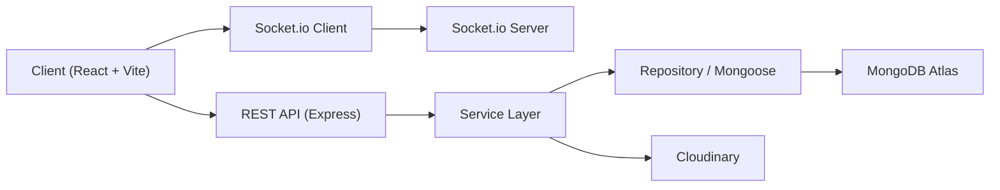

<div align="center">

# Gundam Universe Store

### Website bán hàng và sàn trao đổi giao dịch Gundam theo phong cách mecha / HUD / futuristic

[](./client)
[](./server)
[](./server)
[](./server)
[](./DEPLOYMENT.md)

[](https://cloudinary.com/)
[](#bảo-mật-và-hiệu-suất)
[](./client)
[](./server/package.json)

</div>

---

## Mục lục

- [Tổng quan](#tổng-quan)
- [Giá trị của dự án](#giá-trị-của-dự-án)
- [Tính năng nổi bật](#tính-năng-nổi-bật)
- [Tech stack và phiên bản](#tech-stack-và-phiên-bản)
- [Kiến trúc hệ thống](#kiến-trúc-hệ-thống)
- [Cấu trúc thư mục](#cấu-trúc-thư-mục)
- [Domain model và collection](#domain-model-và-collection)
- [API chính](#api-chính)
- [Bảo mật và hiệu suất](#bảo-mật-và-hiệu-suất)
- [UI/UX design direction](#uiux-design-direction)
- [Cài đặt local](#cài-đặt-local)
- [Biến môi trường](#biến-môi-trường)
- [Seed dữ liệu](#seed-dữ-liệu)
- [Deploy](#deploy)
- [Trạng thái hiện tại](#trạng-thái-hiện-tại)
- [Roadmap tiếp theo](#roadmap-tiếp-theo)

## Tổng quan

`Gundam Universe Store` là một hệ thống full-stack kết hợp hai domain trong cùng một nền tảng:

| Domain | Mô tả |
| --- | --- |
| `Gundam Store` | Bán sản phẩm Gundam/Gunpla với catalog, tìm kiếm, lọc, giỏ hàng, checkout, lịch sử đơn hàng |
| `Trade Exchange` | Sàn trao đổi Gundam với trade listing, trade offer, chat realtime, report moderation |

Dự án được xây dựng theo hướng:

- kiến trúc module hóa, rõ domain
- clean code, dễ đọc, dễ mở rộng
- UI đậm chất mecha / sci-fi / tactical HUD
- có thể dùng cho đồ án và tiếp tục phát triển thành sản phẩm thật

## Giá trị của dự án

README này hướng đến 3 mục tiêu:

| Mục tiêu | Giá trị |
| --- | --- |
| `Đồ án` | Trình bày rõ kiến trúc, tính năng, data flow và hướng triển khai |
| `Demo` | Có đầy đủ flow MVP để thuyết trình và demo trực tiếp |
| `Thực chiến` | Đã có nền tảng deploy, upload media, auth, realtime, moderation, seller/admin console |

## Tính năng nổi bật

### 1. Auth và account

| Tính năng | Trạng thái |
| --- | --- |
| Đăng ký / đăng nhập / đăng xuất | Hoàn thành |
| Refresh token | Hoàn thành |
| Quên mật khẩu / đặt lại mật khẩu | Hoàn thành |
| Đổi mật khẩu | Hoàn thành |
| Cập nhật profile | Hoàn thành |
| Upload avatar Cloudinary | Hoàn thành |
| Ghi nhớ email đăng nhập | Hoàn thành |
| Phục hồi session từ refresh token | Hoàn thành |

### 2. Store module

| Tính năng | Trạng thái |
| --- | --- |
| Home page | Hoàn thành |
| Product listing | Hoàn thành |
| Search / filter / sort | Hoàn thành |
| Product detail | Hoàn thành |
| Related products | Hoàn thành |
| Rare item valuation mô phỏng | Hoàn thành |
| Cart page | Hoàn thành |
| Checkout | Hoàn thành |
| Order history | Hoàn thành |
| Order detail / tracking cơ bản | Hoàn thành |
| Wishlist | Hoàn thành |
| Review | Hoàn thành |

### 3. Trade module

| Tính năng | Trạng thái |
| --- | --- |
| Tạo trade listing | Hoàn thành |
| Upload ảnh listing | Hoàn thành |
| Gửi trade offer | Hoàn thành |
| Upload ảnh offer | Hoàn thành |
| Accept / reject offer | Hoàn thành |
| Chat realtime | Hoàn thành |
| Report vi phạm | Hoàn thành |
| Trade suggestion theo wishlist | MVP |

### 4. Seller và admin

| Tính năng | Trạng thái |
| --- | --- |
| Seller dashboard | Hoàn thành |
| Seller product operations | Hoàn thành |
| Seller order operations | Hoàn thành |
| Admin dashboard | Hoàn thành |
| Admin product/category/user/order management | Hoàn thành |
| Admin trade moderation | Hoàn thành |
| Admin report resolution note | Hoàn thành |

### 5. UX và state persistence

| Tính năng | Trạng thái |
| --- | --- |
| Responsive mobile / tablet / desktop | Hoàn thành |
| Split-screen friendly | Hoàn thành |
| Persist cart / wishlist / notifications | Hoàn thành |
| Persist checkout draft | Hoàn thành |
| Persist trade draft | Hoàn thành |
| Persist chat draft theo conversation | Hoàn thành |

## Tech stack và phiên bản

### Frontend

| Công nghệ | Phiên bản |
| --- | --- |
| React | `18.3.1` |
| React DOM | `18.3.1` |
| Vite | `5.4.1` |
| React Router DOM | `6.22.3` |
| TailwindCSS | `3.4.3` |
| Framer Motion | `11.0.24` |
| Axios | `1.6.8` |
| Zustand | `4.5.2` |
| Socket.io Client | `4.7.5` |
| Lucide React | `0.363.0` |

### Backend

| Công nghệ | Phiên bản |
| --- | --- |
| Node.js | `>= 18` |
| Express | `5.2.1` |
| Mongoose | `9.3.3` |
| Joi | `18.1.2` |
| JWT | `9.0.3` |
| bcrypt | `6.0.0` |
| Socket.io | `4.8.3` |
| Cloudinary | `1.41.3` |
| Multer | `2.1.1` |
| Helmet | `8.1.0` |
| express-rate-limit | `8.3.2` |

### Tooling và deploy

| Công nghệ | Vai trò |
| --- | --- |
| MongoDB Atlas | Database production |
| Cloudinary | Lưu trữ media upload |
| Vercel | Deploy frontend |
| Render | Deploy backend + websocket |
| Nodemon | Dev server backend |

## Kiến trúc hệ thống

### Kiến trúc tổng thể



### Nguyên tắc thiết kế

| Nguyên tắc | Cách áp dụng |
| --- | --- |
| `OOP` | Chia theo controller / service / repository / model |
| `SOLID` | Service xử lý nghiệp vụ, controller không nhận quá nhiều logic |
| `DRY` | Tái sử dụng middleware, store, helper, response wrapper |
| `KISS` | Hạn chế nesting sâu, flow route ngắn gọn |
| `Modular Domain` | Mỗi domain có route, controller, service, repository, validator riêng |

### Data flow chính

1. User thao tác từ giao diện React.
2. Frontend gửi request qua `Axios`.
3. Route Express tiếp nhận request.
4. Controller điều phối service.
5. Service xử lý business logic.
6. Repository / model thao tác MongoDB.
7. Response trả về theo `ApiResponse`.
8. Nếu là chat / notification, Socket.io phát event realtime.

## Cấu trúc thư mục

```text
Gundam_Universe_Store/
├─ client/
│  ├─ src/
│  │  ├─ components/
│  │  ├─ config/
│  │  ├─ guards/
│  │  ├─ pages/
│  │  ├─ services/
│  │  ├─ shared/
│  │  ├─ stores/
│  │  ├─ styles/
│  │  ├─ utils/
│  │  ├─ App.jsx
│  │  └─ Router.jsx
│  ├─ .env.example
│  ├─ package.json
│  └─ vercel.json
├─ server/
│  ├─ scripts/
│  ├─ src/
│  │  ├─ config/
│  │  ├─ modules/
│  │  │  ├─ admin/
│  │  │  ├─ auth/
│  │  │  ├─ cart/
│  │  │  ├─ chat/
│  │  │  ├─ notification/
│  │  │  ├─ order/
│  │  │  ├─ product/
│  │  │  ├─ report/
│  │  │  ├─ review/
│  │  │  ├─ seller/
│  │  │  ├─ trade/
│  │  │  ├─ upload/
│  │  │  ├─ user/
│  │  │  └─ wishlist/
│  │  └─ shared/
│  ├─ .env.example
│  └─ package.json
├─ DEPLOYMENT.md
├─ render.yaml
└─ README.md
```

## Domain model và collection

### Collection chính

| Collection | Vai trò |
| --- | --- |
| `users` | Tài khoản, role, profile, reputation, avatar |
| `categories` | Danh mục sản phẩm |
| `products` | Catalog Gundam/Gunpla |
| `carts` | Giỏ hàng của user |
| `orders` | Đơn hàng và snapshot item |
| `reviews` | Đánh giá sản phẩm |
| `wishlists` | Danh sách sản phẩm yêu thích |
| `tradeListings` | Tin đăng trao đổi |
| `tradeOffers` | Đề nghị trao đổi |
| `conversations` | Cuộc hội thoại chat |
| `messages` | Tin nhắn realtime |
| `notifications` | Thông báo hệ thống |
| `reports` | Báo cáo vi phạm |

### Quan hệ giữa các entity

| Quan hệ | Kiểu |
| --- | --- |
| `User -> Product` | one-to-many |
| `User -> Order` | one-to-many |
| `User -> Wishlist` | one-to-one |
| `Product -> Review` | one-to-many |
| `TradeListing -> TradeOffer` | one-to-many |
| `TradeOffer -> Conversation` | one-to-one gần đúng |
| `Conversation -> Message` | one-to-many |

### Embed và reference

| Kiểu | Vị trí | Lý do |
| --- | --- | --- |
| `Embed` | `order.items` | Snapshot giá / tên / hình tại thời điểm mua |
| `Embed` | `product.images` | Truy cập nhanh giao diện sản phẩm |
| `Embed` | `tradeListing.images` | Truy cập nhanh cho trade detail |
| `Embed` | `tradeOffer.images` | Gắn liền với đề nghị trade |
| `Embed` | `shippingAddress` | Cố định theo đơn hàng |
| `Reference` | `product.category` | Tái sử dụng category |
| `Reference` | `product.seller` | Liên kết seller profile |
| `Reference` | `wishlist.products` | Danh sách sản phẩm động |
| `Reference` | `tradeListing.owner` | Liên kết owner |
| `Reference` | `tradeOffer.offerer` | Liên kết người gửi offer |

## API chính

### Auth

| Method | Endpoint | Mô tả |
| --- | --- | --- |
| `POST` | `/api/auth/register` | Đăng ký |
| `POST` | `/api/auth/login` | Đăng nhập |
| `POST` | `/api/auth/logout` | Đăng xuất |
| `POST` | `/api/auth/refresh-token` | Làm mới access token |
| `POST` | `/api/auth/forgot-password` | Quên mật khẩu |
| `POST` | `/api/auth/reset-password` | Đặt lại mật khẩu |
| `PUT` | `/api/auth/change-password` | Đổi mật khẩu |

### Product / Store

| Method | Endpoint | Mô tả |
| --- | --- | --- |
| `GET` | `/api/products` | Listing + search/filter/sort |
| `GET` | `/api/products/:slug` | Chi tiết sản phẩm |
| `GET` | `/api/products/:slug/recommendations` | Sản phẩm liên quan |
| `POST` | `/api/products` | Tạo sản phẩm |
| `PUT` | `/api/products/:id` | Sửa sản phẩm |
| `DELETE` | `/api/products/:id` | Xóa sản phẩm |

### Cart / Order

| Method | Endpoint | Mô tả |
| --- | --- | --- |
| `GET` | `/api/cart` | Lấy giỏ hàng |
| `POST` | `/api/cart/items` | Thêm item |
| `PATCH` | `/api/cart/items/:productId` | Cập nhật số lượng |
| `DELETE` | `/api/cart/items/:productId` | Xóa item |
| `POST` | `/api/orders/checkout` | Tạo đơn hàng |
| `GET` | `/api/orders/history` | Lịch sử mua hàng |
| `GET` | `/api/orders/:id` | Chi tiết đơn hàng |
| `PATCH` | `/api/orders/:id/status` | Admin cập nhật status |

### Trade / Chat / Moderation

| Method | Endpoint | Mô tả |
| --- | --- | --- |
| `GET` | `/api/trades` | Listing trade |
| `GET` | `/api/trades/:id` | Chi tiết trade |
| `POST` | `/api/trades` | Tạo trade listing |
| `POST` | `/api/trades/:id/offers` | Tạo trade offer |
| `GET` | `/api/trades/:id/offers` | Lấy offer của listing |
| `PATCH` | `/api/trades/:id/offers/:offerId/status` | Accept / reject offer |
| `GET` | `/api/trades/offers/me` | Lấy offer đã gửi |
| `GET` | `/api/trades/suggestions/me` | Trade suggestion |
| `POST` | `/api/trades/:id/report` | Báo cáo vi phạm |

### Seller / Admin / Notification

| Method | Endpoint | Mô tả |
| --- | --- | --- |
| `GET` | `/api/seller/dashboard` | Dashboard seller |
| `GET` | `/api/seller/products` | Quản lý product seller |
| `PATCH` | `/api/seller/products/:id` | Update stock / status / price |
| `GET` | `/api/seller/orders` | Quản lý order của seller |
| `PATCH` | `/api/seller/orders/:id/status` | Seller đổi status order |
| `GET` | `/api/admin/stats` | Dashboard admin |
| `GET` | `/api/admin/users` | Quản lý user |
| `GET` | `/api/admin/orders` | Quản lý order |
| `GET` | `/api/admin/trades` | Moderation trade |
| `PATCH` | `/api/admin/trades/:id/status` | Đổi status trade |
| `GET` | `/api/reports` | Lấy danh sách report |
| `PATCH` | `/api/reports/:id/status` | Resolve / dismiss report |
| `GET` | `/api/notifications` | Lấy notification |

## Bảo mật và hiệu suất

### Bảo mật

| Hạng mục | Áp dụng |
| --- | --- |
| Password hash | `bcrypt` |
| Auth | `JWT access token + refresh token` |
| Refresh rotation | Có |
| Rate limit | Có |
| Security headers | `helmet` |
| NoSQL injection protection | `express-mongo-sanitize` |
| HPP protection | `hpp` |
| Request validation | `Joi` |
| Role guard | `guest / customer / seller / trader / admin` |
| Upload safety | middleware + mime/size handling |

### Hiệu suất

| Hạng mục | Ghi chú |
| --- | --- |
| Pagination | Product và trade listing |
| MongoDB index | name, description, tags, category, seller, trade status |
| Compression | `compression()` |
| Code splitting | Route lazy-load trên frontend |
| State persistence | Giảm friction khi refresh / quay lại trang |
| Realtime room | Chat theo conversation room |

## UI/UX design direction

| Thành phần | Định hướng |
| --- | --- |
| Mood | Mecha, sci-fi, tactical HUD, cockpit UI |
| Màu chủ đạo | Navy / charcoal / metallic gray |
| Accent | Cyan / red / amber |
| Card | Border glow, panel control, contrast cao |
| Motion | Framer Motion, fade/slide, hover glow |
| Layout | Responsive, split-screen friendly, dễ scan thông tin |

## Cài đặt local

### Yêu cầu môi trường

| Requirement | Giá trị |
| --- | --- |
| Node.js | `>= 18` |
| npm | `>= 9` |
| Database | MongoDB Atlas hoặc MongoDB local |
| Media | Cloudinary nếu muốn upload ảnh thật |

### Clone repo

```bash
git clone https://github.com/KasierBach/Gundam_Universe_Store.git
cd Gundam_Universe_Store
```

### Cài dependency

```bash
cd server
npm install

cd ../client
npm install
```

### Chạy backend

```bash
cd server
npm run dev
```

Backend mặc định:

- `http://localhost:5001`
- Health check: `http://localhost:5001/api/health`

### Chạy frontend

```bash
cd client
npm run dev
```

Frontend dev mặc định:

- `http://localhost:4000`

## Biến môi trường

### Backend

File mẫu: [`server/.env.example`](./server/.env.example)

```env
NODE_ENV=development
PORT=5001
MONGODB_URI=your_mongodb_uri
JWT_ACCESS_SECRET=your_access_secret
JWT_REFRESH_SECRET=your_refresh_secret
JWT_ACCESS_EXPIRES_IN=1h
JWT_REFRESH_EXPIRES_IN=30d
CLOUDINARY_CLOUD_NAME=your_cloud_name
CLOUDINARY_API_KEY=your_api_key
CLOUDINARY_API_SECRET=your_api_secret
CLIENT_URL=http://localhost:4000
CLIENT_URLS=http://localhost:4000,https://your-project.vercel.app
RATE_LIMIT_WINDOW_MS=900000
RATE_LIMIT_MAX_REQUESTS=100
```

### Frontend

File mẫu: [`client/.env.example`](./client/.env.example)

```env
VITE_API_URL=/api
VITE_SOCKET_URL=http://localhost:5001
VITE_DEV_API_TARGET=http://localhost:5001
```

## Seed dữ liệu

### Seed admin

```bash
cd server
npm run seed:admin
```

Tài khoản admin mặc định:

| Trường | Giá trị |
| --- | --- |
| Email | `admin@gundamuniverse.com` |
| Password | `Admin@123456` |

### Seed dữ liệu sản phẩm

```bash
cd server
npm run seed:data
```

Catalog seed hiện tại đã được thay bằng bộ sản phẩm Gundam thực tế hơn, phục vụ demo store và search/filter.

## Deploy

Phương án deploy được chốt sẵn:

| Layer | Nền tảng |
| --- | --- |
| Frontend | `Vercel` |
| Backend + Socket.io | `Render` |
| Database | `MongoDB Atlas` |
| Media | `Cloudinary` |

Tài liệu chi tiết:

- [`DEPLOYMENT.md`](./DEPLOYMENT.md)

File deploy:

- [`render.yaml`](./render.yaml)
- [`client/vercel.json`](./client/vercel.json)

## Trạng thái hiện tại

Dự án hiện ở mức:

| Tiêu chí | Đánh giá |
| --- | --- |
| MVP full-stack | Mạnh |
| Đồ họa chủ đề Gundam | Rõ ràng |
| Deploy friendly | Có |
| Seller/Admin operations | Đã có nền tảng tốt |
| Moderation flow | Đã có MVP |
| Testing | Chưa đầy đủ |
| Production completeness | Chưa 100% |

### Đã có khá đầy đủ

- auth
- profile
- store listing
- cart
- checkout
- order history
- trade listing
- trade offer
- realtime chat
- wishlist
- notifications
- seller operations
- admin moderation cơ bản

### Chưa full 100% production

- test suite bài bản
- dispute workflow sâu hơn
- community / social layer
- recommendation engine thông minh hơn
- notification center realtime nâng cao

## Roadmap tiếp theo

| Ưu tiên | Hạng mục |
| --- | --- |
| `P1` | Unit test / integration test / e2e |
| `P1` | Dispute workflow nhiều bước |
| `P2` | Community feed / collector showcase |
| `P2` | Recommendation engine theo hành vi |
| `P2` | Analytics nâng cao cho seller/admin |
| `P3` | Notification center realtime nâng cao |
| `P3` | Email service thật cho reset password |

---

## Ghi chú

Mình đã dùng bản README không dấu ở vòng trước để tránh lỗi encoding trong terminal, nhưng điều đó không phù hợp với tài liệu tiếng Việt trên GitHub. Bản hiện tại đã được trả lại đầy đủ dấu tiếng Việt và phù hợp hơn để:

- nộp đồ án
- đọc trên GitHub
- onboarding người tiếp quản repo
- làm tài liệu tổng quan cho phase deploy và báo cáo
